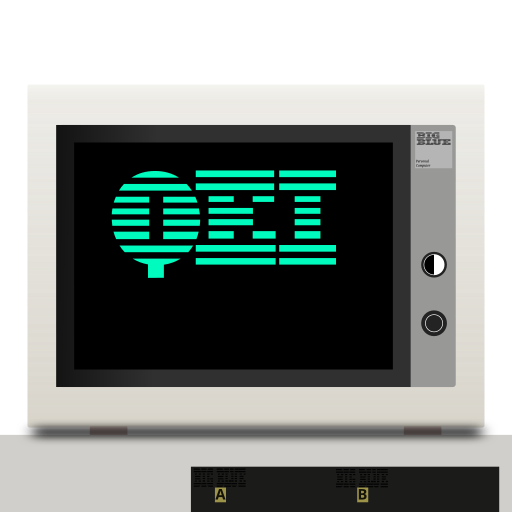

# QuickEmulatorsInstall

<picture>
    
</picture>

### Dependencies

* Flatpak installaed
* Flathub added as a repository
* Wget
* Git-core

### Installation methods

#### GIt
Step 1: Clone repository and cd into the newly created directory
`https://github.com/UniFanNumOne/QuickEmulatorsInstall.git && cd QuickEmulatorsInstall`

Step 2: Run script
`./install.sh`

*****Artifical Inteligince was not used in the creation of this program. All code & imagery were human made.*****

<picture>
    
</picture>
